# ANP CNG Stations | Fábio R. Nóbrega  

This project is a **data collection and enrichment API** built with [.NET 9 Minimal API](https://learn.microsoft.com/en-us/aspnet/core/fundamentals/minimal-apis?view=aspnetcore-9.0).  
It fetches public station data from the [ANP (Agência Nacional do Petróleo Gás natural e Biocombustivel - National Agency of Petroleum, Natural Gas and Biofuels)](https://revendedoresapi.anp.gov.br/swagger/index.html) API, using the [official government doc](https://www.gov.br/anp/pt-br/centrais-de-conteudo/paineis-dinamicos-da-anp/paineis-dinamicos-do-abastecimento/api-revendedores-manual-usuario.pdf?utm_source=chatgpt.com) applies a **multi-layer filtering and scoring system**, and exports a **CSV file** with verified **CNG (GNV) truck stations** across Brazil.  

The project’s core innovation is the **Accuracy Score System**, which intelligently evaluates station infrastructure, fuel type, and location indicators to identify those most likely to support **heavy-vehicle refueling**.  

---

## Table of contents

* [Setup](#setup)  
* [Usage](#usage)  
* [Architecture](#architecture)  
* [Endpoints](#endpoints)  
* [Accuracy Score System](#accuracy-score-system)  
* [Troubleshooting](#troubleshooting)  
* [Git Guideline](#git-guideline)  

---

## Setup

### 1. Clone and Run

Clone the repository and move into the project folder:

```bash
cd anp-trucks-cng-stations
```

Ensure **Docker Desktop** is running, then start the API:

```bash
make docker-run
```

This will:
- Build the Docker image using `.NET 9.0`
- Start the API on port **8080**
- Load environment variables from `.env`

---

### 2. Environment Variables

You must have a `.env` file containing your **Google Maps Platform key** use the .envtemplate as reference:  

```bash
GOOGLE_MAPS_KEY=your_google_maps_api_key_here
```

Make sure the following APIs are **enabled** in your Google Cloud project:
- **Geocoding API**
- **Places API**
- **Maps JavaScript API**

---

### 3. Postman / Insomnia Configuration

Some endpoints may take several minutes (especially CSV enrichment).  
To avoid timeout errors, increase the request timeout to **10 minutes (600,000 ms)**:

- **Postman:** Settings → General → Request Timeout (ms) → `600000`  
- **Insomnia:** Preferences → Network → Request Timeout → `600000`

---

## Usage

Once the container is running, access the API:

```
http://localhost:8080
```

You can call it from the browser, `curl`, or API tools like [Insomnia](https://insomnia.rest).

Example:

```bash
curl http://localhost:8080/truck-cgn-stations -o cng_stations.csv
```

---

## Endpoints

| Endpoint | Method | Description |
|-----------|--------|-------------|
| `/health` | GET | Returns server uptime and environment info |
| `/truck-cgn-stations` | GET | Fetches and filters CNG stations from ANP API |
| `/truck-cng-stations/add-coords/upload-csv` | POST | Uploads a CSV and enriches it with coordinates |
| `/truck-cng-stations/enrich-data/upload-csv` | POST | Uses Google Places API to add accurate coordinates and metadata |

---

## Architecture

```mermaid
flowchart LR
    user([🧠 Data Analyst / Developer])
    api([⚙️ ANP CNG Stations API<br/>.NET 9 Minimal API])
    anp([🌍 ANP Revendedores API])
    google([🗺️ Google Places API])
    azure([☁️ Azure Maps API])
    mapbox([📍 Mapbox Geocoding])
    csv[(📊 CSV Export)]

    user --> api
    api --> anp
    api --> google
    api --> azure
    api --> mapbox
    api --> csv
```



**Stack Summary**
- **.NET SDK:** 9.0  
- **CSV:** CsvHelper  
- **Containerization:** Docker + Makefile  
- **Geocoders:** Mapbox, Azure Maps, and Google Places  
- **Environment file:** `.env`  

---

## Accuracy Score System

The **Accuracy Score** is the brain of this project — it determines how likely a station is to support **CNG refueling for trucks**.

This score is not a single condition but the **sum of multiple signals** that together form a reliability index.  
The design came from comparing patterns between **[Naturgy’s official verified list](https://www.naturgy.com.br/gnv/para-veiculos-pesados/)** and all ANP stations.

### Logic Behind the System

When analyzing Naturgy’s verified truck CNG stations, I noticed they shared consistent characteristics:

1. They always sell **Diesel S10 or S500**, fuels used exclusively by heavy vehicles.  
2. They have **diesel storage above 30 m³**, showing infrastructure built for large trucks.  
3. They are located **along major highways**, with addresses containing words like *Rodovia*, *Dutra*, or *KM*.  
   In Brazil, “KM-123” indicates a **federal highway position marker**.  
4. They have **active licenses** (`situacaoConstatada == 200`).  
5. They contain **CNG with multiple dispensers (bicos)** — meaning operational truck fueling capacity.  

From these traits, each station earns points:

| Criterion | Description | Points |
|------------|--------------|---------|
| Has CNG and active bicos | Confirms gas availability | +20 |
| Has Diesel S10/S500 ≥ 30 m³ | Indicates truck infrastructure | +20 |
| Address includes highway terms | Suggests highway location | +20 |
| Station is active | Confirms operational status | +20 |
| GPS accuracy (lower is better) | Adjusts precision score | +10 |
| Naturgy verified CNPJ | Sets score to 100 | Full accuracy |

A score closer to **100** means the station is **highly likely to be truck-compatible**.  
Naturgy stations are automatically set to **100% confidence**.

---

## Troubleshooting

| Issue | Cause | Solution |
|-------|--------|-----------|
| Timeout errors | Long CSV enrichment | Increase timeout to 10 minutes |
| Empty coordinates | Missing address info | Check street, city, and UF fields |
| Invalid API key | Wrong Google Maps key | Verify `.env` key and enabled APIs |
| Partial CSV output | Long processing | Restart — progress resumes from last checkpoint |

---

## Git Guideline

Follow a clean commit and branch structure.

### Branch Naming

- Feature → `feat/branch-name`  
- Fix → `fix/branch-name`  
- Docs → `docs/branch-name`  
- Refactor → `refactor/branch-name`

### Commit Examples
```
feat(api): integrate Google Places geocoder
fix(csv): correct UTF-8 encoding for ANP export
docs(readme): expand score system explanation
```
