# ANP CNG Stations | Fábio R. Nóbrega  

This project is a **data collection and analysis API** built with [.NET 9.0 Minimal API](https://learn.microsoft.com/en-us/aspnet/core/fundamentals/minimal-apis?view=aspnetcore-9.0).  
It retrieves public station data from the **ANP (Agência Nacional do Petróleo)** API, filters the results using custom logic, and exports a **CSV file** with verified **CNG (GNV) truck stations**.  

The project automates pagination, applies location and operational filters, and scores each station with a custom **accuracy index** — identifying stations most likely equipped for heavy-vehicle refueling.  

---

## Table of contents

* [Install](#install)  
* [Usage](#usage)  
* [Architecture](#architecture)  
* [Filtering Logic](#filtering-logic)  
* [Troubleshooting](#troubleshooting)  
* [Git Guideline](#git-guideline)  

---

## Install

Clone the repository and enter the project folder:

```bash
cd AnpCngStations
```

Make sure **Docker Desktop** is installed and running.  
Then build and run the project with:

```bash
make docker-run
```

This will:

- Build the image using `.NET 9.0`
- Start the API container on **port 8080**

---

## Usage

Once running, open your browser or API client at:

```
http://localhost:8080
```

Planned endpoints include:

- `GET /api/export` → fetches data from ANP, applies filters, and returns a CSV file
- `GET /api/stations` → returns parsed and filtered JSON results (WIP)

Example curl:

```bash
curl http://localhost:8080/api/export -o anp_filtered_stations.csv
```

---

## Architecture

### Service Overview

```mermaid
flowchart LR
    user([🧠 Developer / Analyst])
    api([⚙️ ANP CNG Stations API<br/>.NET 9 Minimal API])
    anp([🌍 ANP Revendedores API<br/>revendedoresapi.anp.gov.br])

    user --> api
    api --> anp
    api --> csv[(📊 CSV Export)]
```



### Stack Summary

- **.NET SDK:** 9.0.100  
- **HTTP Client:** built-in `HttpClient` + async pagination  
- **CSV Export:** `CsvHelper`  
- **Containerization:** Docker + Docker Compose  
- **Build tools:** Makefile automation (`make docker-run`, `make clean`, etc.)

---

## Filtering Logic

Stations are included only if:

1. `situacaoConstatada == 200` (active station)  
2. `"GÁS NATURAL VEICULAR"` appears in the fuel products list
3. Address or complement contains `"RODOVIA"`, `"DUTRA"`, `"KM"`  
4. Has beside gás station also Diesel type S10 or S500
5. Total tank capacity ≥ 30 m³ 
6. The station belongs to the **Naturgy** CNPJ list  

Each validation increases an internal **accuracy score**: 

- `+10` for each matching criterion  
- `+60` if the CNPJ is part of the Naturgy list  
- `100% accuracy` means a verified Naturgy truck station  


## Troubleshooting


## Git Guideline

Follow consistent branch and commit naming.

### Branches

- Feature:  `feat/branch-name`  
- Fix:      `fix/branch-name`  
- Refactor: `refactor/branch-name`  
- Docs:     `docs/branch-name`  

### Commit prefixes

- `feat(context): message`  
- `fix(context): message`  
- `chore(context): message`  
- `refactor(context): message`  
- `tests(context): message`  
- `docs(context): message`  
